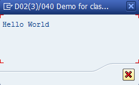

## Класс для формирования и вывода ABAP листингов
Функциональность ABAP листингов конечно является сильно устаревшей. 
Однако применение этой технологии в некоторых случаях являеется уместным, например при выводе информационных диалоговых окон с не сложной функциональностью.
Данный пакет позволяет делать вывод модальных и не модальных ABAP листингов.
Позволяет реализовать любую функциональность которая возможна в технологии ABAP листингов.

Вот программа выводящая диалоговое окно с "Hello World":
```ABAP
CLASS lcl_test DEFINITION.
  PUBLIC SECTION.
    METHODS show_hello_world.

    METHODS list_hello_world
      IMPORTING
        !params TYPE ydk_list=>ty_param_tab
      CHANGING
        !event  TYPE sy-ucomm.
ENDCLASS.

CLASS lcl_test IMPLEMENTATION.
  METHOD show_hello_world.
    ydk_list=>for_instance(
      instance   = me
      method     = 'LIST_HELLO_WORLD'
      params     = VALUE #( ( name = 'MSG' data = REF #( 'Hello World' ) ) )
      width      = 30
      height     = 2
    ).
  ENDMETHOD.

  METHOD list_hello_world.
    FIELD-SYMBOLS <msg> TYPE any.
    DATA: msg_ref TYPE REF TO data.

    CASE event.
      WHEN ydk_list=>ev_list.
        SET PF-STATUS 'DIALOG'.

        msg_ref = params[ name = 'MSG' ]-data.
        ASSIGN msg_ref->* TO <msg>.
        WRITE: / <msg>.
    ENDCASE.
  ENDMETHOD.
ENDCLASS.

START-OF-SELECTION.
  PERFORM start.

FORM start.
  DATA: lo_test TYPE REF TO lcl_test.
  lo_test = NEW lcl_test( ).
  lo_test->show_hello_world( ).
ENDFORM.
```


Все варианты запуска вывода листинга показаны в программе [YDK_LIST_DEMO](src/ydk_list_demo.prog.abap)

Вот небольшое демо показывающае возможности этой устаревшей технологии:
